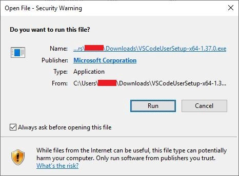
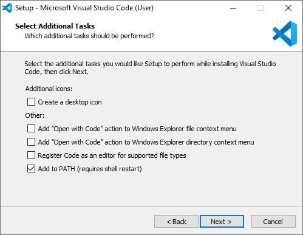

# Vue.js & Restful API Workshop

### Chapter 1: Setup Environment
1.	ขั้นตอนการติดตั้ง Node.js ลงบนเครื่อง <br>
1.1.	ทำการดาวน์โหลดไฟล์ติดตั้งโปรแกรมจากเว็บไซต์ https://nodejs.org/en/

  <!--  -->
  <p align="center"></p>

  1.2.  เมื่อได้ไฟล์ดาวน์โหลดมาแล้วให้ดับเบิลคลิก เพื่อทำการติดตั้ง <br>
  1.3.	click ปุ่ม Next เพื่อดำเนินการติดตั้ง <br>
  
  <p align="center"></p>

  1.4.	ยอมรับข้อตกลงในการติดตั้ง โดยเลือกช่องว่างหน้าข้อความ I accept the term in the License Agreement แล้ว click ปุ่ม Next
  
  <p align="center"></p>
 
  1.5.	เลือกโฟลเดอร์ปลายทางของโปรแกรมที่ต้องการติดตั้ง โดยปกติจะใช้ค่าเริ่มต้นที่กำหนดให้ จากนั้นคลิกปุ่ม Next
  
  <p align="center"></p>
  
  1.6.	ตัวเลือกในการติดตั้ง โดยปกติจะใช้การตั้งค่าเริ่มต้น แล้วคลิกปุ่ม Next
  
  <p align="center"></p>
  
  1.7.	เมื่อเราตั้งค่าการติดตั้งเรียบร้อยแล้ว ก็ถึงเวลาในการติดตั้ง ให้คลิก ปุ่ม Install เพื่อติดตั้ง Node.js
  
  <p align="center"></p>
  
  รอการติดตั้งสักครู่
  
  <p align="center"></p>
  
  1.8.	การติดตั้งเสร็จสมบูรณ์แล้วให้ click ปุ่ม Finish
  
  <p align="center"></p>
  
ตรวจสอบการใช้งาน Node. js
  1.	คลิกที่ปุ่มค้นหาพิมพ์ว่า Command Prompt หรือ cmd จากนั้นเลือก Command Prompt (Run as Administrator)
  2.	ทดสอบพิมพ์คำว่า node -v (คำสั่งตรวจสอบเวอร์ชั่นของ Node.js) โปรแกรมบจะแสดงเวอร์ชั่น ดังภาพ
    
  <p align="center"></p>
  
2.	ขั้นตอนการติดตั้ง Code Editor – Visual Studio Code
2.1.	เข้าไปที่เว็บไซต์ https://code.visualstudio.com/  และ Download โปรแกรม VS Code โดยเลือกให้ตรงกับ OS ของเครื่องคอมพิวเตอร์ <br>
  
  <p align="center"></p>
  
  2.2.	ดับเบิลคลิก หรือคลิกขวาและกด “Open” โปรแกรมที่ดาวน์โหลดมา <br>
  
  <p align="center"></p>
  
  2.3.	คลิกปุ่ม “Run” <br>
  
  <p align="center"></p>
  
  2.4.	เลือก “I accept the agreement” และคลิกปุ่ม “Next >” <br>
  
  <p align="center"></p>
  
  2.5.	เลือกพื้นที่ในการจัดเก็บโปรแกรม (แนะนำให้ใช้ Default ที่ให้มา) และคลิกปุ่ม “Next >”
  
  <p align="center"></p>
  
  2.6.	ตั้งค่าที่อยู่ shortcuts ของโปรแกรม แล้วคลิกปุ่ม “Next >”
  
  <p align="center"></p>
  
  2.7.	เลือกส่วนเพิ่มงานให้เลือก Create a desktop icon และ Add to PATH (requires shell restart) จากนั้นให้คลิกปุ่ม “Next >”
  
  <p align="center"></p>
  
  2.8.	คลิกปุ่ม “Install” เพื่อติดตั้งโปรแกรม 
 
  <p align="center"></p>
  
  2.9.	คลิกปุ่ม “Finish” เสร็จสิ้นการติดตั้งโปรแกรม VS Code
  
  <p align="center"></p>
  
3.	ขั้นตอนการติดตั้ง Vue Command Line บนเครื่องคอมพิวเตอร์ <br>
3.1.	Run command in cmd
```
npm install -g @vue/cli 
```
  <p align="center"></p>
  
  3.1.	Run command in PowerShell (Run as Administrator)
```
npm install --global --production windows-build-tools 
```
  <p align="center"></p>
  
### Chapter 2: Setup Visual Studio Code

1.	การตั้งค่าเพื่อเตรียมใช้งานในโปรแกรม Visual Studio Code<br>
1.1.	เมื่อเริ่มต้นใช้งานจะปรากฏหน้าต่าง ดังภาพ โดยในหน้านี้เราสามารถตั้งค่า VS Code ได้ตามที่ต้องการ หากต้องการข้อไหนให้ทำการคลิกวงกลมหน้าข้อเพื่อเลือก จากนั้นคลิก Mark Done
  
  <p align="center"></p>
  
  เมื่อคลิก Mark Done แล้วจะได้หน้าจอดังต่อไปนี้
  
  <p align="center"></p>
  
  1.2.	ไปที่เมนู View แล้วเลือก Extensions จะได้หน้าต่างดังภาพ
  
  <p align="center"></p>
  
  1.3.	ทำการติดตั้ง Extension ที่เกี่ยวข้องกับ Vue เพื่อให้สะดวกต่อการเขียนโปรแกรม สามารถใช้ช่องค้นหาได้ โดยให้ติดตั้ง Vue Pack กดที่ปุ่ม Install
  
  <p align="center"></p>
  
  เมื่อติดตั้งเสร็จ จะได้ Extension ดังต่อไปนี้
  
  <p align="center"></p>
  
  1.4.	ต่อมาให้ไปที่เมนู Terminal แล้วเลือก New Terminal จะมี Terminal ขึ้นอยู่ที่ด้านล่างของหน้าจอดังภาพ
  
  <p align="center"></p>
  
  1.5.	ทำการเพิ่ม Terminal ใหม่เพื่อใช้ในการรันคำสั่งเพื่อสร้างโปรเจค Vue โดยให้เลือกเป็น Command Line 
  
  <p align="center"></p>
  
  เมื่อเลือกแล้วจะได้ผลลัพธ์ดังนี้
  
  <p align="center"></p>

### Chapter 3: Vue Create Project and Add Plugin
```
vue create restapiproject 
```
```
cd restapiproject
```
Add Vuetify and Router
```
vue add vuetify
```
```
vue add router
```
Create .eslintignore files
```
/build/**
/coverage/**
/docs/**
/jsdoc/**
/templates/**
/tests/bench/**
/tests/fixtures/**
/tests/performance/**
/tmp/**
/tools/internal-rules/node_modules/**
/lib/rules/utils/unicode/is-combining-character.js
test.js
!.eslintrc.js
/src/**
```
Add Axios
```
vue add axios
```
### Create Table for test API
สามารถเลือก Component ต่างๆมาใช้งานได้เว็บไซต์ https://vuetifyjs.com/en/components/data-tables/ โดยจะเลือกใช้ตารางรูปแบบ CRUD Action
```
<template>
  <v-data-table
    :headers="headers"
    :items="desserts"
    sort-by="calories"
    class="elevation-1"
  >
    <template v-slot:top>
      <v-toolbar
        flat
      >
        <v-toolbar-title>My CRUD</v-toolbar-title>
        <v-divider
          class="mx-4"
          inset
          vertical
        ></v-divider>
        <v-spacer></v-spacer>
        <v-dialog
          v-model="dialog"
          max-width="500px"
        >
          <template v-slot:activator="{ on, attrs }">
            <v-btn
              color="primary"
              dark
              class="mb-2"
              v-bind="attrs"
              v-on="on"
            >
              New Item
            </v-btn>
          </template>
          <v-card>
            <v-card-title>
              <span class="text-h5">{{ formTitle }}</span>
            </v-card-title>

            <v-card-text>
              <v-container>
                <v-row>
                  <v-col
                    cols="12"
                    sm="6"
                    md="4"
                  >
                    <v-text-field
                      v-model="editedItem.name"
                      label="Dessert name"
                    ></v-text-field>
                  </v-col>
                  <v-col
                    cols="12"
                    sm="6"
                    md="4"
                  >
                    <v-text-field
                      v-model="editedItem.calories"
                      label="Calories"
                    ></v-text-field>
                  </v-col>
                  <v-col
                    cols="12"
                    sm="6"
                    md="4"
                  >
                    <v-text-field
                      v-model="editedItem.fat"
                      label="Fat (g)"
                    ></v-text-field>
                  </v-col>
                  <v-col
                    cols="12"
                    sm="6"
                    md="4"
                  >
                    <v-text-field
                      v-model="editedItem.carbs"
                      label="Carbs (g)"
                    ></v-text-field>
                  </v-col>
                  <v-col
                    cols="12"
                    sm="6"
                    md="4"
                  >
                    <v-text-field
                      v-model="editedItem.protein"
                      label="Protein (g)"
                    ></v-text-field>
                  </v-col>
                </v-row>
              </v-container>
            </v-card-text>

            <v-card-actions>
              <v-spacer></v-spacer>
              <v-btn
                color="blue darken-1"
                text
                @click="close"
              >
                Cancel
              </v-btn>
              <v-btn
                color="blue darken-1"
                text
                @click="save"
              >
                Save
              </v-btn>
            </v-card-actions>
          </v-card>
        </v-dialog>
        <v-dialog v-model="dialogDelete" max-width="500px">
          <v-card>
            <v-card-title class="text-h5">Are you sure you want to delete this item?</v-card-title>
            <v-card-actions>
              <v-spacer></v-spacer>
              <v-btn color="blue darken-1" text @click="closeDelete">Cancel</v-btn>
              <v-btn color="blue darken-1" text @click="deleteItemConfirm">OK</v-btn>
              <v-spacer></v-spacer>
            </v-card-actions>
          </v-card>
        </v-dialog>
      </v-toolbar>
    </template>
    <template v-slot:item.actions="{ item }">
      <v-icon
        small
        class="mr-2"
        @click="editItem(item)"
      >
        mdi-pencil
      </v-icon>
      <v-icon
        small
        @click="deleteItem(item)"
      >
        mdi-delete
      </v-icon>
    </template>
    <template v-slot:no-data>
      <v-btn
        color="primary"
        @click="initialize"
      >
        Reset
      </v-btn>
    </template>
  </v-data-table>
</template>
<script>
  export default {
    data: () => ({
      dialog: false,
      dialogDelete: false,
      headers: [
        {
          text: 'Dessert (100g serving)',
          align: 'start',
          sortable: false,
          value: 'name',
        },
        { text: 'Calories', value: 'calories' },
        { text: 'Fat (g)', value: 'fat' },
        { text: 'Carbs (g)', value: 'carbs' },
        { text: 'Protein (g)', value: 'protein' },
        { text: 'Actions', value: 'actions', sortable: false },
      ],
      desserts: [],
      editedIndex: -1,
      editedItem: {
        name: '',
        calories: 0,
        fat: 0,
        carbs: 0,
        protein: 0,
      },
      defaultItem: {
        name: '',
        calories: 0,
        fat: 0,
        carbs: 0,
        protein: 0,
      },
    }),

    computed: {
      formTitle () {
        return this.editedIndex === -1 ? 'New Item' : 'Edit Item'
      },
    },

    watch: {
      dialog (val) {
        val || this.close()
      },
      dialogDelete (val) {
        val || this.closeDelete()
      },
    },

    created () {
      this.initialize()
    },

    methods: {
      initialize () {
        this.desserts = [
          {
            name: 'Frozen Yogurt',
            calories: 159,
            fat: 6.0,
            carbs: 24,
            protein: 4.0,
          },
          {
            name: 'Ice cream sandwich',
            calories: 237,
            fat: 9.0,
            carbs: 37,
            protein: 4.3,
          },
          {
            name: 'Eclair',
            calories: 262,
            fat: 16.0,
            carbs: 23,
            protein: 6.0,
          },
          {
            name: 'Cupcake',
            calories: 305,
            fat: 3.7,
            carbs: 67,
            protein: 4.3,
          },
          {
            name: 'Gingerbread',
            calories: 356,
            fat: 16.0,
            carbs: 49,
            protein: 3.9,
          },
          {
            name: 'Jelly bean',
            calories: 375,
            fat: 0.0,
            carbs: 94,
            protein: 0.0,
          },
          {
            name: 'Lollipop',
            calories: 392,
            fat: 0.2,
            carbs: 98,
            protein: 0,
          },
          {
            name: 'Honeycomb',
            calories: 408,
            fat: 3.2,
            carbs: 87,
            protein: 6.5,
          },
          {
            name: 'Donut',
            calories: 452,
            fat: 25.0,
            carbs: 51,
            protein: 4.9,
          },
          {
            name: 'KitKat',
            calories: 518,
            fat: 26.0,
            carbs: 65,
            protein: 7,
          },
        ]
      },

      editItem (item) {
        this.editedIndex = this.desserts.indexOf(item)
        this.editedItem = Object.assign({}, item)
        this.dialog = true
      },

      deleteItem (item) {
        this.editedIndex = this.desserts.indexOf(item)
        this.editedItem = Object.assign({}, item)
        this.dialogDelete = true
      },

      deleteItemConfirm () {
        this.desserts.splice(this.editedIndex, 1)
        this.closeDelete()
      },

      close () {
        this.dialog = false
        this.$nextTick(() => {
          this.editedItem = Object.assign({}, this.defaultItem)
          this.editedIndex = -1
        })
      },

      closeDelete () {
        this.dialogDelete = false
        this.$nextTick(() => {
          this.editedItem = Object.assign({}, this.defaultItem)
          this.editedIndex = -1
        })
      },

      save () {
        if (this.editedIndex > -1) {
          Object.assign(this.desserts[this.editedIndex], this.editedItem)
        } else {
          this.desserts.push(this.editedItem)
        }
        this.close()
      },
    },
  }
</script>
```


### Compiles and reloads for development
```
npm run serve
```

### Chapter 4: Create API
```
npm install -g json-server
```

### Create db.json file
Create a db.json file with some data
```
{
    "data": [
        {
            "id":1,
            "name": "Frozen Yogurt",
            "calories": "159",
            "fat": "6.0",
            "carbs": 24,
            "protein": 4.0
        },
        {
            "id":2,
            "name": "Ice cream sandwich",
            "calories": 237,
            "fat": 9.0,
            "carbs": 37,
            "protein": 4.3
        },
        {
            "id":3,
            "name": "Eclair",
            "calories": "262",
            "fat": 16.0,
            "carbs": 23,
            "protein": 6.0
        },
        {
            "id":4,
            "name": "Cupcake",
            "calories": 305,
            "fat": 3.7,
            "carbs": 67,
            "protein": 4.3
        },
        {
            "id":5,
            "name": "Gingerbread",
            "calories": 356,
            "fat": 16.0,
            "carbs": 49,
            "protein": 3.9
        },
        {
            "id":6,
            "name": "Jelly bean",
            "calories": 375,
            "fat": 0.0,
            "carbs": 94,
            "protein": 0.0
        },
        {
            "id":7,
            "name": "Lollipop",
            "calories": 392,
            "fat": 0.2,
            "carbs": 98,
            "protein": 0
        },
        {
            "id":8,
            "name": "Honeycomb",
            "calories": 408,
            "fat": 3.2,
            "carbs": 87,
            "protein": 6.5
        },
        {
            "id":9,
            "name": "Donut",
            "calories": 452,
            "fat": 25.0,
            "carbs": 51,
            "protein": 4.9
        },
        {
            "id":10,
            "name": "KitKat",
            "calories": 518,
            "fat": 26.0,
            "carbs": 65,
            "protein": 7
        }
    ]
}
```
### Start JSON Server
```
json-server --watch db.json
```
Now if you go to http://localhost:3000/data
  
### Chapter 5: Basic use Postman
  
### Routes
Based on the previous db.json file, here are all the default routes. You can also add other routes using --routes.
```
GET    localhost:3000/data
GET    localhost:3000/data/1
GET    localhost:3000/data/?name=Donut
POST   localhost:3000/data
PUT    localhost:3000/data/1
DELETE localhost:3000/data/1
```

### Chapter 6: Use API with Vue Web Application 
 
